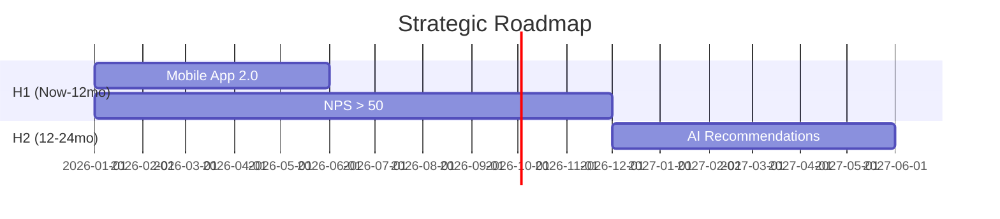

# Export System Overhaul Specification

**Version:** 1.0
**Date:** February 2026
**Status:** Draft for Review

---

## Executive Summary

This specification defines a comprehensive overhaul of the Strategy Pyramid export system, focusing on:

1. **Unified Element Selection Model** - Fine-grained control over what elements to include in exports
2. **Professional Design System** - Consistent styling, icons, and visual hierarchy across all formats
3. **Format-Specific Enhancements** - Improved layouts, diagrams, and polish for each export type

---

## Table of Contents

1. [Element Selection Model](#1-element-selection-model)
2. [Design System](#2-design-system)
3. [Icon Library](#3-icon-library)
4. [Format Specifications](#4-format-specifications)
5. [API Changes](#5-api-changes)
6. [Frontend Components](#6-frontend-components)
7. [Implementation Phases](#7-implementation-phases)

---

## 1. Element Selection Model

### 1.1 Core Selection Schema

The selection model provides fine-grained control over every element in the pyramid. This schema is shared between frontend (TypeScript) and backend (Python).

```typescript
// frontend/types/export-selection.ts

interface ExportElementSelection {
  // ═══════════════════════════════════════════════════════════════════
  // TIER 1: FOUNDATION (Vision/Mission/Purpose)
  // ═══════════════════════════════════════════════════════════════════
  foundation: {
    enabled: boolean;                    // Master toggle for entire tier
    statementTypes: {
      vision: boolean;
      mission: boolean;
      purpose: boolean;
      belief: boolean;
      passion: boolean;
      aspiration: boolean;
    };
  };

  // ═══════════════════════════════════════════════════════════════════
  // TIER 2: VALUES
  // ═══════════════════════════════════════════════════════════════════
  values: {
    enabled: boolean;                    // Master toggle
    includeDescriptions: boolean;        // Include value descriptions
    selectedIds?: string[];              // Specific value IDs (null = all)
  };

  // ═══════════════════════════════════════════════════════════════════
  // TIER 3: BEHAVIOURS
  // ═══════════════════════════════════════════════════════════════════
  behaviours: {
    enabled: boolean;
    groupByValue: boolean;               // Group behaviours under their values
    selectedIds?: string[];
  };

  // ═══════════════════════════════════════════════════════════════════
  // TIER 5: STRATEGIC DRIVERS
  // ═══════════════════════════════════════════════════════════════════
  drivers: {
    enabled: boolean;
    includeDescriptions: boolean;
    includeRationale: boolean;           // Why this driver was chosen
    selectedIds?: string[];              // Specific drivers (null = all)
  };

  // ═══════════════════════════════════════════════════════════════════
  // TIER 4: STRATEGIC INTENTS
  // ═══════════════════════════════════════════════════════════════════
  intents: {
    enabled: boolean;
    filterByDrivers: boolean;            // Only show intents for selected drivers
    includeBoldnessScore: boolean;
    selectedIds?: string[];
  };

  // ═══════════════════════════════════════════════════════════════════
  // TIER 6: ENABLERS
  // ═══════════════════════════════════════════════════════════════════
  enablers: {
    enabled: boolean;
    includeDescriptions: boolean;
    groupByType: boolean;                // Group by enabler_type
    filterByDrivers: boolean;            // Only enablers for selected drivers
    selectedIds?: string[];
  };

  // ═══════════════════════════════════════════════════════════════════
  // TIER 7: ICONIC COMMITMENTS
  // ═══════════════════════════════════════════════════════════════════
  commitments: {
    enabled: boolean;
    includeDescriptions: boolean;
    includeMetrics: boolean;             // is_time_bound, is_tangible, is_measurable
    includeOwners: boolean;
    includeTargetDates: boolean;
    includeSecondaryAlignments: boolean;
    horizons: {
      H1: boolean;                       // 0-12 months
      H2: boolean;                       // 12-24 months
      H3: boolean;                       // 24-36 months
    };
    filterByDrivers: boolean;            // Only commitments for selected drivers
    selectedIds?: string[];
  };

  // ═══════════════════════════════════════════════════════════════════
  // TIER 8: TEAM OBJECTIVES
  // ═══════════════════════════════════════════════════════════════════
  teamObjectives: {
    enabled: boolean;
    includeDescriptions: boolean;
    includeMetrics: boolean;
    includeOwners: boolean;
    filterByTeams?: string[];            // Specific team names
    filterByCommitments: boolean;        // Only for selected commitments
    selectedIds?: string[];
  };

  // ═══════════════════════════════════════════════════════════════════
  // TIER 9: INDIVIDUAL OBJECTIVES
  // ═══════════════════════════════════════════════════════════════════
  individualObjectives: {
    enabled: boolean;
    includeDescriptions: boolean;
    includeSuccessCriteria: boolean;
    filterByTeamObjectives: boolean;
    selectedIds?: string[];
  };

  // ═══════════════════════════════════════════════════════════════════
  // SUPPLEMENTARY ELEMENTS
  // ═══════════════════════════════════════════════════════════════════
  supplementary: {
    distribution: boolean;               // Distribution analysis table
    tensions: boolean;                   // Strategic tensions
    stakeholders: boolean;               // Stakeholder map
    socc: boolean;                       // SOCC context analysis
    metadata: boolean;                   // Project metadata (name, org, dates)
    coverPage: boolean;                  // Cover page (Word/PPT)
    tableOfContents: boolean;            // TOC (Word/Markdown)
  };
}
```

### 1.2 Python Backend Schema

```python
# src/pyramid_builder/exports/element_selection.py

from typing import Optional, List, Literal
from pydantic import BaseModel, Field


class FoundationSelection(BaseModel):
    enabled: bool = True
    statement_types: dict[str, bool] = Field(default_factory=lambda: {
        "vision": True,
        "mission": True,
        "purpose": True,
        "belief": True,
        "passion": True,
        "aspiration": True,
    })


class ValuesSelection(BaseModel):
    enabled: bool = True
    include_descriptions: bool = True
    selected_ids: Optional[List[str]] = None  # None = all


class BehavioursSelection(BaseModel):
    enabled: bool = True
    group_by_value: bool = True
    selected_ids: Optional[List[str]] = None


class DriversSelection(BaseModel):
    enabled: bool = True
    include_descriptions: bool = True
    include_rationale: bool = False
    selected_ids: Optional[List[str]] = None


class IntentsSelection(BaseModel):
    enabled: bool = True
    filter_by_drivers: bool = True
    include_boldness_score: bool = False
    selected_ids: Optional[List[str]] = None


class EnablersSelection(BaseModel):
    enabled: bool = True
    include_descriptions: bool = True
    group_by_type: bool = False
    filter_by_drivers: bool = True
    selected_ids: Optional[List[str]] = None


class HorizonSelection(BaseModel):
    H1: bool = True
    H2: bool = True
    H3: bool = True


class CommitmentsSelection(BaseModel):
    enabled: bool = True
    include_descriptions: bool = True
    include_metrics: bool = False
    include_owners: bool = False
    include_target_dates: bool = True
    include_secondary_alignments: bool = False
    horizons: HorizonSelection = Field(default_factory=HorizonSelection)
    filter_by_drivers: bool = True
    selected_ids: Optional[List[str]] = None


class TeamObjectivesSelection(BaseModel):
    enabled: bool = False  # Off by default
    include_descriptions: bool = True
    include_metrics: bool = True
    include_owners: bool = True
    filter_by_teams: Optional[List[str]] = None
    filter_by_commitments: bool = True
    selected_ids: Optional[List[str]] = None


class IndividualObjectivesSelection(BaseModel):
    enabled: bool = False  # Off by default
    include_descriptions: bool = True
    include_success_criteria: bool = True
    filter_by_team_objectives: bool = True
    selected_ids: Optional[List[str]] = None


class SupplementarySelection(BaseModel):
    distribution: bool = True
    tensions: bool = False
    stakeholders: bool = False
    socc: bool = False
    metadata: bool = True
    cover_page: bool = True
    table_of_contents: bool = True


class ExportElementSelection(BaseModel):
    """Complete element selection model for exports."""

    foundation: FoundationSelection = Field(default_factory=FoundationSelection)
    values: ValuesSelection = Field(default_factory=ValuesSelection)
    behaviours: BehavioursSelection = Field(default_factory=BehavioursSelection)
    drivers: DriversSelection = Field(default_factory=DriversSelection)
    intents: IntentsSelection = Field(default_factory=IntentsSelection)
    enablers: EnablersSelection = Field(default_factory=EnablersSelection)
    commitments: CommitmentsSelection = Field(default_factory=CommitmentsSelection)
    team_objectives: TeamObjectivesSelection = Field(default_factory=TeamObjectivesSelection)
    individual_objectives: IndividualObjectivesSelection = Field(default_factory=IndividualObjectivesSelection)
    supplementary: SupplementarySelection = Field(default_factory=SupplementarySelection)
```

### 1.3 Audience Presets

Audience types become named presets that populate the selection model:

```python
# src/pyramid_builder/exports/presets.py

from .element_selection import ExportElementSelection

AUDIENCE_PRESETS = {
    "executive": ExportElementSelection(
        foundation={"enabled": True, "statement_types": {"vision": True, "mission": True}},
        values={"enabled": True, "include_descriptions": False},
        behaviours={"enabled": False},
        drivers={"enabled": True, "include_descriptions": False, "include_rationale": False},
        intents={"enabled": False},
        enablers={"enabled": False},
        commitments={
            "enabled": True,
            "include_descriptions": False,
            "horizons": {"H1": True, "H2": False, "H3": False},
        },
        team_objectives={"enabled": False},
        individual_objectives={"enabled": False},
        supplementary={
            "distribution": False,
            "cover_page": True,
            "table_of_contents": False,
        },
    ),

    "leadership": ExportElementSelection(
        foundation={"enabled": True},
        values={"enabled": True, "include_descriptions": True},
        behaviours={"enabled": True},
        drivers={"enabled": True, "include_descriptions": True, "include_rationale": True},
        intents={"enabled": True},
        enablers={"enabled": True},
        commitments={
            "enabled": True,
            "include_descriptions": True,
            "horizons": {"H1": True, "H2": True, "H3": True},
        },
        team_objectives={"enabled": False},
        individual_objectives={"enabled": False},
        supplementary={
            "distribution": True,
            "cover_page": True,
            "table_of_contents": True,
        },
    ),

    "detailed": ExportElementSelection(
        # Everything enabled with full detail
        foundation={"enabled": True},
        values={"enabled": True, "include_descriptions": True},
        behaviours={"enabled": True, "group_by_value": True},
        drivers={"enabled": True, "include_descriptions": True, "include_rationale": True},
        intents={"enabled": True, "include_boldness_score": True},
        enablers={"enabled": True, "include_descriptions": True, "group_by_type": True},
        commitments={
            "enabled": True,
            "include_descriptions": True,
            "include_metrics": True,
            "include_owners": True,
            "include_target_dates": True,
            "include_secondary_alignments": True,
            "horizons": {"H1": True, "H2": True, "H3": True},
        },
        team_objectives={"enabled": True, "include_metrics": True, "include_owners": True},
        individual_objectives={"enabled": True, "include_success_criteria": True},
        supplementary={
            "distribution": True,
            "tensions": True,
            "stakeholders": True,
            "socc": True,
            "cover_page": True,
            "table_of_contents": True,
        },
    ),

    "team": ExportElementSelection(
        # Focused on cascade: drivers → commitments → team objectives
        foundation={"enabled": True, "statement_types": {"vision": True, "mission": True}},
        values={"enabled": True, "include_descriptions": False},
        behaviours={"enabled": False},
        drivers={"enabled": True, "include_descriptions": True},
        intents={"enabled": True},
        enablers={"enabled": False},
        commitments={
            "enabled": True,
            "include_descriptions": True,
            "include_owners": True,
            "horizons": {"H1": True, "H2": True, "H3": False},
        },
        team_objectives={"enabled": True, "include_metrics": True, "include_owners": True},
        individual_objectives={"enabled": False},
        supplementary={
            "distribution": False,
            "cover_page": False,
            "table_of_contents": False,
        },
    ),

    "custom": None,  # User-defined selection
}
```

### 1.4 Selection Helper Utilities

```python
# src/pyramid_builder/exports/selection_filter.py

from typing import List, Optional
from uuid import UUID
from ..models.pyramid import StrategyPyramid
from .element_selection import ExportElementSelection


class SelectionFilter:
    """Applies element selection to filter pyramid content for export."""

    def __init__(self, pyramid: StrategyPyramid, selection: ExportElementSelection):
        self.pyramid = pyramid
        self.selection = selection
        self._selected_driver_ids: Optional[List[UUID]] = None

    @property
    def selected_driver_ids(self) -> List[UUID]:
        """Get IDs of selected drivers (cached)."""
        if self._selected_driver_ids is None:
            if not self.selection.drivers.enabled:
                self._selected_driver_ids = []
            elif self.selection.drivers.selected_ids:
                self._selected_driver_ids = [
                    UUID(id) for id in self.selection.drivers.selected_ids
                ]
            else:
                self._selected_driver_ids = [d.id for d in self.pyramid.strategic_drivers]
        return self._selected_driver_ids

    def get_vision_statements(self):
        """Get filtered vision statements based on selection."""
        if not self.selection.foundation.enabled or not self.pyramid.vision:
            return []

        return [
            stmt for stmt in self.pyramid.vision.get_statements_ordered()
            if self.selection.foundation.statement_types.get(stmt.statement_type.value, False)
        ]

    def get_values(self):
        """Get filtered values based on selection."""
        if not self.selection.values.enabled:
            return []

        values = self.pyramid.values
        if self.selection.values.selected_ids:
            selected = set(self.selection.values.selected_ids)
            values = [v for v in values if str(v.id) in selected]

        return values

    def get_behaviours(self):
        """Get filtered behaviours based on selection."""
        if not self.selection.behaviours.enabled:
            return []

        behaviours = self.pyramid.behaviours
        if self.selection.behaviours.selected_ids:
            selected = set(self.selection.behaviours.selected_ids)
            behaviours = [b for b in behaviours if str(b.id) in selected]

        return behaviours

    def get_drivers(self):
        """Get filtered drivers based on selection."""
        if not self.selection.drivers.enabled:
            return []

        drivers = self.pyramid.strategic_drivers
        if self.selection.drivers.selected_ids:
            selected = set(self.selection.drivers.selected_ids)
            drivers = [d for d in drivers if str(d.id) in selected]

        return drivers

    def get_intents(self):
        """Get filtered intents based on selection."""
        if not self.selection.intents.enabled:
            return []

        intents = self.pyramid.strategic_intents

        # Filter by selected drivers if enabled
        if self.selection.intents.filter_by_drivers and self.selected_driver_ids:
            intents = [i for i in intents if i.driver_id in self.selected_driver_ids]

        if self.selection.intents.selected_ids:
            selected = set(self.selection.intents.selected_ids)
            intents = [i for i in intents if str(i.id) in selected]

        return intents

    def get_enablers(self):
        """Get filtered enablers based on selection."""
        if not self.selection.enablers.enabled:
            return []

        enablers = self.pyramid.enablers

        # Filter by selected drivers if enabled
        if self.selection.enablers.filter_by_drivers and self.selected_driver_ids:
            enablers = [
                e for e in enablers
                if any(did in self.selected_driver_ids for did in e.driver_ids)
            ]

        if self.selection.enablers.selected_ids:
            selected = set(self.selection.enablers.selected_ids)
            enablers = [e for e in enablers if str(e.id) in selected]

        return enablers

    def get_commitments(self):
        """Get filtered commitments based on selection."""
        if not self.selection.commitments.enabled:
            return []

        commitments = self.pyramid.iconic_commitments

        # Filter by horizon
        horizons = self.selection.commitments.horizons
        enabled_horizons = []
        if horizons.H1:
            enabled_horizons.append("H1")
        if horizons.H2:
            enabled_horizons.append("H2")
        if horizons.H3:
            enabled_horizons.append("H3")

        commitments = [c for c in commitments if c.horizon.value in enabled_horizons]

        # Filter by selected drivers if enabled
        if self.selection.commitments.filter_by_drivers and self.selected_driver_ids:
            commitments = [
                c for c in commitments
                if c.primary_driver_id in self.selected_driver_ids
            ]

        if self.selection.commitments.selected_ids:
            selected = set(self.selection.commitments.selected_ids)
            commitments = [c for c in commitments if str(c.id) in selected]

        return commitments

    def get_team_objectives(self):
        """Get filtered team objectives based on selection."""
        if not self.selection.team_objectives.enabled:
            return []

        objectives = self.pyramid.team_objectives

        # Filter by team names
        if self.selection.team_objectives.filter_by_teams:
            teams = set(self.selection.team_objectives.filter_by_teams)
            objectives = [o for o in objectives if o.team_name in teams]

        # Filter by selected commitments
        if self.selection.team_objectives.filter_by_commitments:
            selected_commitment_ids = {c.id for c in self.get_commitments()}
            objectives = [
                o for o in objectives
                if o.primary_commitment_id in selected_commitment_ids
                or any(cid in selected_commitment_ids for cid in o.secondary_commitment_ids)
            ]

        if self.selection.team_objectives.selected_ids:
            selected = set(self.selection.team_objectives.selected_ids)
            objectives = [o for o in objectives if str(o.id) in selected]

        return objectives

    def get_individual_objectives(self):
        """Get filtered individual objectives based on selection."""
        if not self.selection.individual_objectives.enabled:
            return []

        objectives = self.pyramid.individual_objectives

        # Filter by selected team objectives
        if self.selection.individual_objectives.filter_by_team_objectives:
            selected_team_ids = {o.id for o in self.get_team_objectives()}
            objectives = [
                o for o in objectives
                if any(tid in selected_team_ids for tid in o.team_objective_ids)
            ]

        if self.selection.individual_objectives.selected_ids:
            selected = set(self.selection.individual_objectives.selected_ids)
            objectives = [o for o in objectives if str(o.id) in selected]

        return objectives
```

---

## 2. Design System

### 2.1 Color Palette

```python
# src/pyramid_builder/exports/design_system.py

from dataclasses import dataclass
from typing import Tuple


@dataclass
class RGB:
    """RGB color representation."""
    r: int
    g: int
    b: int

    def to_tuple(self) -> Tuple[int, int, int]:
        return (self.r, self.g, self.b)

    def to_hex(self) -> str:
        return f"#{self.r:02x}{self.g:02x}{self.b:02x}"


class DesignColors:
    """Strategy Pyramid design color palette."""

    # ═══════════════════════════════════════════════════════════════════
    # PRIMARY BRAND COLORS
    # ═══════════════════════════════════════════════════════════════════
    PRIMARY = RGB(31, 78, 121)        # Deep blue - main brand color
    PRIMARY_LIGHT = RGB(68, 114, 157) # Lighter blue for hover/secondary
    SECONDARY = RGB(44, 62, 80)       # Dark slate for headings
    ACCENT = RGB(230, 126, 34)        # Orange for emphasis/CTAs

    # ═══════════════════════════════════════════════════════════════════
    # HORIZON COLORS (for commitments timeline)
    # ═══════════════════════════════════════════════════════════════════
    HORIZON_H1 = RGB(39, 174, 96)     # Green - Now to 12 months
    HORIZON_H2 = RGB(52, 152, 219)    # Blue - 12-24 months
    HORIZON_H3 = RGB(230, 126, 34)    # Orange - 24-36 months

    # ═══════════════════════════════════════════════════════════════════
    # TIER-SPECIFIC COLORS
    # ═══════════════════════════════════════════════════════════════════
    TIER_FOUNDATION = RGB(142, 68, 173)   # Purple - Vision/Mission
    TIER_VALUES = RGB(22, 160, 133)       # Teal - Values
    TIER_BEHAVIOURS = RGB(26, 188, 156)   # Aqua - Behaviours
    TIER_DRIVERS = RGB(192, 57, 43)       # Coral red - Strategic Drivers
    TIER_INTENTS = RGB(155, 89, 182)      # Light purple - Intents
    TIER_ENABLERS = RGB(52, 73, 94)       # Dark blue-gray - Enablers
    TIER_COMMITMENTS = RGB(41, 128, 185)  # Blue - Commitments
    TIER_TEAM = RGB(22, 160, 133)         # Teal - Team objectives
    TIER_INDIVIDUAL = RGB(127, 140, 141)  # Gray - Individual objectives

    # ═══════════════════════════════════════════════════════════════════
    # NEUTRAL COLORS
    # ═══════════════════════════════════════════════════════════════════
    TEXT_PRIMARY = RGB(44, 62, 80)        # Main text
    TEXT_SECONDARY = RGB(127, 140, 141)   # Muted text
    TEXT_LIGHT = RGB(189, 195, 199)       # Very light text
    BACKGROUND = RGB(255, 255, 255)       # White
    BACKGROUND_ALT = RGB(248, 249, 250)   # Light gray background
    BORDER = RGB(189, 195, 199)           # Border color
    BORDER_LIGHT = RGB(236, 240, 241)     # Light border


class DesignTypography:
    """Typography specifications for exports."""

    # Font families
    HEADING_FONT = "Calibri"
    BODY_FONT = "Calibri"
    MONO_FONT = "Consolas"

    # Font sizes (in points)
    TITLE = 28
    HEADING_1 = 20
    HEADING_2 = 16
    HEADING_3 = 14
    BODY = 11
    SMALL = 9
    CAPTION = 8

    # Line heights
    HEADING_LINE_HEIGHT = 1.2
    BODY_LINE_HEIGHT = 1.5


class DesignSpacing:
    """Spacing values for consistent layouts."""

    # Margins (in inches for Word/PPT)
    PAGE_MARGIN_TOP = 0.75
    PAGE_MARGIN_BOTTOM = 0.75
    PAGE_MARGIN_LEFT = 0.75
    PAGE_MARGIN_RIGHT = 0.75

    # Section spacing (in points)
    SECTION_SPACING = 24
    SUBSECTION_SPACING = 16
    PARAGRAPH_SPACING = 12
    ITEM_SPACING = 6
```

### 2.2 CSS Variables (Frontend)

```css
/* frontend/styles/design-system.css */

:root {
  /* Primary brand colors */
  --color-primary: #1f4e79;
  --color-primary-light: #447299;
  --color-secondary: #2c3e50;
  --color-accent: #e67e22;

  /* Horizon colors */
  --color-horizon-h1: #27ae60;
  --color-horizon-h2: #3498db;
  --color-horizon-h3: #e67e22;

  /* Tier colors */
  --color-tier-foundation: #8e44ad;
  --color-tier-values: #16a085;
  --color-tier-behaviours: #1abc9c;
  --color-tier-drivers: #c0392b;
  --color-tier-intents: #9b59b6;
  --color-tier-enablers: #34495e;
  --color-tier-commitments: #2980b9;
  --color-tier-team: #16a085;
  --color-tier-individual: #7f8c8d;

  /* Neutral colors */
  --color-text-primary: #2c3e50;
  --color-text-secondary: #7f8c8d;
  --color-text-light: #bdc3c7;
  --color-background: #ffffff;
  --color-background-alt: #f8f9fa;
  --color-border: #bdc3c7;
  --color-border-light: #ecf0f1;

  /* Typography */
  --font-heading: 'Calibri', 'Segoe UI', sans-serif;
  --font-body: 'Calibri', 'Segoe UI', sans-serif;

  /* Spacing */
  --spacing-xs: 4px;
  --spacing-sm: 8px;
  --spacing-md: 16px;
  --spacing-lg: 24px;
  --spacing-xl: 32px;
  --spacing-xxl: 48px;
}
```

---

## 3. Icon Library

### 3.1 Icon Set Definition

We will use a custom SVG icon set for professional appearance. Each tier has a designated icon.

| Tier | Icon Name | Description |
|------|-----------|-------------|
| Foundation | `icon-vision` | Eye with horizon line |
| Mission | `icon-mission` | Target/bullseye |
| Values | `icon-values` | Heart with checkmark |
| Behaviours | `icon-behaviours` | Person in motion |
| Drivers | `icon-drivers` | Compass |
| Intents | `icon-intents` | Flag/banner |
| Enablers | `icon-enablers` | Gear/cog |
| Commitments | `icon-commitments` | Calendar with checkmark |
| Team Objectives | `icon-team` | Group of people |
| Individual | `icon-individual` | Single person |
| Horizon H1 | `icon-h1` | Sprint/lightning |
| Horizon H2 | `icon-h2` | Hourglass |
| Horizon H3 | `icon-h3` | Telescope |

### 3.2 Icon Storage Structure

```
frontend/public/icons/export/
├── icon-vision.svg
├── icon-mission.svg
├── icon-values.svg
├── icon-behaviours.svg
├── icon-drivers.svg
├── icon-intents.svg
├── icon-enablers.svg
├── icon-commitments.svg
├── icon-team.svg
├── icon-individual.svg
├── icon-h1.svg
├── icon-h2.svg
├── icon-h3.svg
└── strategy-pyramid-logo.svg

src/pyramid_builder/exports/assets/
├── icons/               # PNG versions for Word/PPT embedding
│   ├── icon-vision.png
│   ├── ... (same set)
└── logo/
    └── strategy-pyramid-logo.png
```

### 3.3 Icon Component (Frontend)

```typescript
// frontend/components/exports/TierIcon.tsx

import React from 'react';

type TierIconType =
  | 'vision' | 'mission' | 'values' | 'behaviours'
  | 'drivers' | 'intents' | 'enablers' | 'commitments'
  | 'team' | 'individual' | 'h1' | 'h2' | 'h3';

interface TierIconProps {
  type: TierIconType;
  size?: 'sm' | 'md' | 'lg';
  className?: string;
}

const ICON_SIZES = {
  sm: 16,
  md: 24,
  lg: 32,
};

export const TierIcon: React.FC<TierIconProps> = ({
  type,
  size = 'md',
  className = ''
}) => {
  return (
    
  );
};
```

### 3.4 Python Icon Utilities

```python
# src/pyramid_builder/exports/icons.py

from pathlib import Path
from typing import Optional
from enum import Enum


class TierIcon(str, Enum):
    """Available tier icons."""
    VISION = "icon-vision"
    MISSION = "icon-mission"
    VALUES = "icon-values"
    BEHAVIOURS = "icon-behaviours"
    DRIVERS = "icon-drivers"
    INTENTS = "icon-intents"
    ENABLERS = "icon-enablers"
    COMMITMENTS = "icon-commitments"
    TEAM = "icon-team"
    INDIVIDUAL = "icon-individual"
    H1 = "icon-h1"
    H2 = "icon-h2"
    H3 = "icon-h3"
    LOGO = "strategy-pyramid-logo"


def get_icon_path(icon: TierIcon, format: str = "png") -> Path:
    """Get the file path for an icon."""
    base_path = Path(__file__).parent / "assets" / "icons"
    return base_path / f"{icon.value}.{format}"


def get_icon_for_tier(tier_name: str) -> Optional[TierIcon]:
    """Map tier name to icon."""
    mapping = {
        "vision": TierIcon.VISION,
        "mission": TierIcon.MISSION,
        "foundation": TierIcon.VISION,
        "values": TierIcon.VALUES,
        "behaviours": TierIcon.BEHAVIOURS,
        "behaviors": TierIcon.BEHAVIOURS,
        "drivers": TierIcon.DRIVERS,
        "strategic_drivers": TierIcon.DRIVERS,
        "intents": TierIcon.INTENTS,
        "strategic_intents": TierIcon.INTENTS,
        "enablers": TierIcon.ENABLERS,
        "commitments": TierIcon.COMMITMENTS,
        "iconic_commitments": TierIcon.COMMITMENTS,
        "team_objectives": TierIcon.TEAM,
        "individual_objectives": TierIcon.INDIVIDUAL,
    }
    return mapping.get(tier_name.lower())


def get_icon_for_horizon(horizon: str) -> TierIcon:
    """Map horizon to icon."""
    mapping = {
        "H1": TierIcon.H1,
        "H2": TierIcon.H2,
        "H3": TierIcon.H3,
    }
    return mapping.get(horizon, TierIcon.COMMITMENTS)
```

---

## 4. Format Specifications

### 4.1 Word Document Enhancements

#### 4.1.1 Document Structure

```
┌─────────────────────────────────────────────────────────────────┐
│                         COVER PAGE                               │
│  ┌─────────────────────────────────────────────────────────────┐│
│  │  [Strategy Pyramid Logo]                                    ││
│  │                                                             ││
│  │           STRATEGIC BLUEPRINT                               ││
│  │           ━━━━━━━━━━━━━━━━━━━                               ││
│  │                                                             ││
│  │           Organization Name                                 ││
│  │           Project Name                                      ││
│  │                                                             ││
│  │  ┌─────────────────────────────────────────────────────┐   ││
│  │  │ Version: 2.1        │ Created: Jan 2026            │   ││
│  │  │ Author: John Smith  │ Last Modified: Feb 2026      │   ││
│  │  └─────────────────────────────────────────────────────┘   ││
│  └─────────────────────────────────────────────────────────────┘│
├─────────────────────────────────────────────────────────────────┤
│                      TABLE OF CONTENTS                           │
│  1. Vision & Mission ................................. 3         │
│  2. Our Values ....................................... 4         │
│  3. Strategic Drivers ................................ 5         │
│     3.1 Driver: Customer Experience .................. 6         │
│     3.2 Driver: Digital Transformation ............... 8         │
│  4. Iconic Commitments ............................... 10        │
│  5. Distribution Analysis ............................ 15        │
├─────────────────────────────────────────────────────────────────┤
│                    SECTION: VISION & MISSION                     │
│  ┌─────────────────────────────────────────────────────────────┐│
│  │ [👁 icon]  VISION                                           ││
│  │ ─────────────────────────────────────────────────────────── ││
│  │ "To be the most trusted partner in our customers'          ││
│  │  financial journey"                                         ││
│  └─────────────────────────────────────────────────────────────┘│
│  ┌─────────────────────────────────────────────────────────────┐│
│  │ [🎯 icon]  MISSION                                          ││
│  │ ─────────────────────────────────────────────────────────── ││
│  │ "We simplify complexity, enabling confident decisions"     ││
│  └─────────────────────────────────────────────────────────────┘│
├─────────────────────────────────────────────────────────────────┤
│                    SECTION: STRATEGIC DRIVERS                    │
│                                                                  │
│  ┌───────────────┬───────────────┬───────────────┐              │
│  │   [🧭]        │    [🧭]       │    [🧭]       │              │
│  │  EXPERIENCE   │  PARTNERSHIP  │   SIMPLICITY  │              │
│  │               │               │               │              │
│  │  Description  │  Description  │  Description  │              │
│  │  here...      │  here...      │  here...      │              │
│  └───────────────┴───────────────┴───────────────┘              │
│                                                                  │
├─────────────────────────────────────────────────────────────────┤
│                   DRIVER DETAIL: EXPERIENCE                      │
│  ┌─────────────────────────────────────────────────────────────┐│
│  │ [🧭] EXPERIENCE                              Color: #c0392b ││
│  │ ━━━━━━━━━━━━━━━━━━━━━━━━━━━━━━━━━━━━━━━━━━━━━━━━━━━━━━━━━━ ││
│  │ Description: Transform every customer interaction...        ││
│  │                                                             ││
│  │ STRATEGIC INTENTS                                           ││
│  │ ┌─────────────────────────────────────────────────────────┐ ││
│  │ │ [🚩] "Customers tell stories of delight..."            │ ││
│  │ │ [🚩] "Partners compete to work with us..."             │ ││
│  │ └─────────────────────────────────────────────────────────┘ ││
│  │                                                             ││
│  │ ICONIC COMMITMENTS                                          ││
│  │ ┌──────────────────────────────────────────────────────┐   ││
│  │ │ H1  │ [✓] Launch mobile app 2.0      │ Q2 2026      │   ││
│  │ │ H1  │ [✓] NPS > 50                   │ Q4 2026      │   ││
│  │ │ H2  │ [○] AI-powered recommendations │ Q2 2027      │   ││
│  │ └──────────────────────────────────────────────────────┘   ││
│  └─────────────────────────────────────────────────────────────┘│
└─────────────────────────────────────────────────────────────────┘
```

#### 4.1.2 Key Enhancements

| Feature | Current | Enhanced |
|---------|---------|----------|
| Cover page | Basic table | Professional branded layout with logo |
| Section headers | Plain text | Icon + colored underline + tier color |
| Driver layout | Vertical list | 3-column card layout for overview |
| Driver detail | Basic paragraphs | Boxed sections with visual hierarchy |
| Commitments | Simple table | Horizon-colored badges, status icons |
| Intents | Bullet list | Quoted boxes with flag icons |
| Table of contents | None | Hyperlinked TOC with page numbers |

#### 4.1.3 Word Exporter Changes

```python
# Key methods to add/modify in word_exporter.py

class EnhancedWordExporter:
    """Enhanced Word document exporter with professional styling."""

    def __init__(self, pyramid: StrategyPyramid, selection: ExportElementSelection):
        self.pyramid = pyramid
        self.selection = selection
        self.filter = SelectionFilter(pyramid, selection)
        self.colors = DesignColors()
        self.doc = Document()
        self._setup_styles()

    def _setup_styles(self):
        """Configure custom styles for the document."""
        # Add custom styles for each tier
        # Add icon embedding support
        # Configure header/footer
        pass

    def _add_cover_page(self):
        """Create professional cover page with logo."""
        pass

    def _add_table_of_contents(self):
        """Add hyperlinked table of contents."""
        pass

    def _add_tier_header(self, tier_name: str, icon: TierIcon, color: RGB):
        """Add a styled tier header with icon."""
        pass

    def _add_driver_overview_grid(self):
        """Create 3-column driver overview cards."""
        pass

    def _add_driver_detail_section(self, driver: StrategicDriver):
        """Create detailed driver section with intents and commitments."""
        pass

    def _add_commitment_table(self, commitments: List[IconicCommitment]):
        """Create horizon-colored commitment table."""
        pass
```

---

### 4.2 PowerPoint Enhancements

#### 4.2.1 Slide Templates

**Slide 1: Title Slide**
```
┌─────────────────────────────────────────────────────────────────┐
│                                                                  │
│                    [Strategy Pyramid Logo]                       │
│                                                                  │
│              ━━━━━━━━━━━━━━━━━━━━━━━━━━━━━━━━                   │
│                                                                  │
│                    STRATEGIC BLUEPRINT                           │
│                    Organization Name                             │
│                                                                  │
│              ━━━━━━━━━━━━━━━━━━━━━━━━━━━━━━━━                   │
│                                                                  │
│                    February 2026 | v2.1                          │
│                                                                  │
└─────────────────────────────────────────────────────────────────┘
```

**Slide 2: Strategy at a Glance (NEW - Hierarchy Diagram)**
```
┌─────────────────────────────────────────────────────────────────┐
│  STRATEGY AT A GLANCE                                            │
│  ━━━━━━━━━━━━━━━━━━━━                                           │
│                                                                  │
│                    ┌───────────────┐                            │
│                    │    VISION     │                            │
│                    │   [👁 icon]   │                            │
│                    └───────┬───────┘                            │
│              ┌─────────────┼─────────────┐                      │
│              │             │             │                      │
│        ┌─────▼─────┐ ┌─────▼─────┐ ┌─────▼─────┐               │
│        │ EXPERIENCE│ │PARTNERSHIP│ │ SIMPLICITY│               │
│        │   [🧭]    │ │   [🧭]    │ │   [🧭]    │               │
│        └─────┬─────┘ └─────┬─────┘ └─────┬─────┘               │
│              │             │             │                      │
│         ┌────┴────┐   ┌────┴────┐   ┌────┴────┐                │
│         │ 4 items │   │ 3 items │   │ 5 items │                │
│         │   H1-H3 │   │   H1-H2 │   │   H1-H3 │                │
│         └─────────┘   └─────────┘   └─────────┘                │
│                                                                  │
└─────────────────────────────────────────────────────────────────┘
```

**Slide 3: Vision & Values**
```
┌─────────────────────────────────────────────────────────────────┐
│  VISION & VALUES                                                 │
│  ━━━━━━━━━━━━━━━━                                               │
│                                                                  │
│  ┌─────────────────────────────────────────────────────────────┐│
│  │ [👁]  VISION                                                ││
│  │ "To be the most trusted partner in our customers'          ││
│  │  financial journey"                                         ││
│  └─────────────────────────────────────────────────────────────┘│
│                                                                  │
│  ┌─────────┐  ┌─────────┐  ┌─────────┐  ┌─────────┐            │
│  │   [❤]   │  │   [❤]   │  │   [❤]   │  │   [❤]   │            │
│  │  Trust  │  │ Courage │  │ Together│  │ Simple  │            │
│  └─────────┘  └─────────┘  └─────────┘  └─────────┘            │
│                                                                  │
└─────────────────────────────────────────────────────────────────┘
```

**Slide 4-N: Driver Deep-Dive (one per driver)**
```
┌─────────────────────────────────────────────────────────────────┐
│  [🧭] EXPERIENCE                                    [Color bar] │
│  ━━━━━━━━━━━━━━━━━━━━━━━━━━━━━━━━━━━━━━━━━━━━━━━━━━━━━━━━━━━━  │
│                                                                  │
│  Transform every customer interaction into a moment of delight  │
│                                                                  │
│  ┌───────────────────────┐  ┌────────────────────────────────┐ │
│  │ STRATEGIC INTENTS     │  │ ICONIC COMMITMENTS             │ │
│  │ ───────────────────── │  │ ──────────────────────────────│ │
│  │                       │  │                                │ │
│  │ [🚩] "Customers tell  │  │ ┌──────┬──────────────┬──────┐│ │
│  │      stories..."      │  │ │ [H1] │ Mobile 2.0   │ Q2'26││ │
│  │                       │  │ │ [H1] │ NPS > 50     │ Q4'26││ │
│  │ [🚩] "Partners        │  │ │ [H2] │ AI Recs      │ Q2'27││ │
│  │      compete..."      │  │ └──────┴──────────────┴──────┘│ │
│  │                       │  │                                │ │
│  └───────────────────────┘  └────────────────────────────────┘ │
│                                                                  │
└─────────────────────────────────────────────────────────────────┘
```

**Slide N+1: Horizon Roadmap (NEW)**
```
┌─────────────────────────────────────────────────────────────────┐
│  STRATEGIC ROADMAP                                               │
│  ━━━━━━━━━━━━━━━━━━                                             │
│                                                                  │
│       H1 (Now-12mo)       H2 (12-24mo)       H3 (24-36mo)       │
│  ═══════●═══════════════════●═══════════════════●═══════════   │
│         │                   │                   │               │
│    ┌────┴────┐         ┌────┴────┐         ┌────┴────┐         │
│    │[GREEN]  │         │ [BLUE]  │         │[ORANGE] │         │
│    │ 8 items │         │ 5 items │         │ 3 items │         │
│    └─────────┘         └─────────┘         └─────────┘         │
│                                                                  │
│  ┌─────────────────────────────────────────────────────────────┐│
│  │ H1 Highlights:                                              ││
│  │ • Launch mobile app 2.0 (Experience)                        ││
│  │ • Complete API gateway migration (Digital)                  ││
│  │ • Achieve NPS > 50 (Experience)                             ││
│  └─────────────────────────────────────────────────────────────┘│
└─────────────────────────────────────────────────────────────────┘
```

#### 4.2.2 Key Enhancements

| Feature | Current | Enhanced |
|---------|---------|----------|
| Title slide | Basic text | Branded with logo and styled typography |
| Overview | None | Strategy hierarchy diagram |
| Driver slides | Text list | Two-column with intents + commitments |
| Timeline | None | Visual horizon roadmap |
| Commitment display | Plain table | Horizon-colored badges |
| Visual consistency | Minimal | Consistent color-coded headers |

---

### 4.3 Strategic Blueprint Enhancements

#### 4.3.1 Visual Improvements

**Header Bar (NEW)**
```
┌─────────────────────────────────────────────────────────────────┐
│ [Logo]  STRATEGIC BLUEPRINT          Org Name  │  Feb 2026 v2.1│
└─────────────────────────────────────────────────────────────────┘
```

**Section Headers with Icons**
```
┌─────────────────────────────────────────────────────────────────┐
│ [🧭]  STRATEGIC DRIVERS                                [#c0392b]│
│ ━━━━━━━━━━━━━━━━━━━━━━━━━━━━━━━━━━━━━━━━━━━━━━━━━━━━━━━━━━━━━━ │
```

**Driver Cards with Visual Hierarchy**
```
┌───────────────────────┐
│ [🧭] EXPERIENCE       │  ← Icon + name
│ ───────────────────── │  ← Colored underline
│ Transform every       │
│ customer interaction  │  ← Description
│                       │
│ ┌───────────────────┐ │
│ │ INTENTS           │ │  ← Nested section
│ │ • "Customers..."  │ │
│ │ • "Partners..."   │ │
│ └───────────────────┘ │
│                       │
│ ┌───────────────────┐ │
│ │ COMMITMENTS       │ │
│ │ [H1] Mobile 2.0   │ │  ← Horizon badges
│ │ [H2] AI Platform  │ │
│ └───────────────────┘ │
└───────────────────────┘
```

**Connection Lines (Simple)**
```
    ┌─────────────┐
    │   VISION    │
    └──────┬──────┘
           │
    ┌──────┴──────┐
    │             │
┌───▼───┐    ┌───▼───┐
│Driver1│    │Driver2│
└───┬───┘    └───┬───┘
    │            │
    ▼            ▼
  [Commitments grouped below]
```

#### 4.3.2 Interactive Features (Screen Only)

These features appear on screen but simplify or hide for print:

1. **Collapsible sections** - Click to expand/collapse tier details
2. **Hover tooltips** - Show full descriptions on hover
3. **Filter chips** - Quick toggles for horizons (H1/H2/H3)
4. **Connection highlighting** - Hover on driver highlights related commitments

```typescript
// Conditional rendering based on print mode
const [isPrintMode, setIsPrintMode] = useState(false);

// Detect print
useEffect(() => {
  const mediaQuery = window.matchMedia('print');
  const handleChange = (e: MediaQueryListEvent) => setIsPrintMode(e.matches);
  mediaQuery.addEventListener('change', handleChange);
  return () => mediaQuery.removeEventListener('change', handleChange);
}, []);

// In render
{!isPrintMode && (
  <button onClick={() => toggleSection('drivers')}>
    {expandedSections.drivers ? '−' : '+'}
  </button>
)}
```

---

### 4.4 Markdown Enhancements

#### 4.4.1 Structure Improvements

```markdown
# Strategic Blueprint

> **Organization:** Acme Corp
> **Version:** 2.1 | **Date:** February 2026

---

## Table of Contents

- [Vision & Mission](#vision--mission)
- [Our Values](#our-values)
- [Strategic Drivers](#strategic-drivers)
  - [Experience](#driver-experience)
  - [Partnership](#driver-partnership)
- [Iconic Commitments](#iconic-commitments)

---

## Vision & Mission

### 👁 Vision

> "To be the most trusted partner in our customers' financial journey"

### 🎯 Mission

> "We simplify complexity, enabling confident decisions"

---

## Our Values

| Value | Description |
|-------|-------------|
| ❤️ **Trust** | We earn trust through transparency and reliability |
| 💪 **Courage** | We take bold action and embrace change |
| 🤝 **Together** | We succeed as one team |

---

## Strategic Drivers

### 🧭 Driver: Experience

**Description:** Transform every customer interaction into a moment of delight.

#### Strategic Intents

- 🚩 *"Customers tell stories of delight about every interaction with us"*
- 🚩 *"Partners compete to work with us because of our service excellence"*

#### Iconic Commitments

| Horizon | Commitment | Target |
|---------|------------|--------|
| 🟢 H1 | Launch mobile app 2.0 | Q2 2026 |
| 🟢 H1 | Achieve NPS > 50 | Q4 2026 |
| 🔵 H2 | AI-powered recommendations | Q2 2027 |

---

## Horizon Summary



---

## Distribution Analysis

| Driver | H1 | H2 | H3 | Total |
|--------|----|----|----| ----- |
| Experience | 4 | 2 | 1 | 7 |
| Partnership | 2 | 1 | 0 | 3 |
| Simplicity | 2 | 2 | 2 | 6 |
```

#### 4.4.2 Mermaid Diagram Support

Add optional Mermaid diagrams for platforms that support them (GitHub, GitLab, Notion):

```python
def _generate_mermaid_hierarchy(self) -> str:
    """Generate Mermaid diagram of strategy hierarchy."""
    lines = ["```mermaid", "flowchart TD"]

    # Vision at top
    lines.append('    V["🎯 Vision"]')

    # Drivers connected to vision
    for i, driver in enumerate(self.filter.get_drivers()):
        driver_id = f"D{i}"
        lines.append(f'    {driver_id}["🧭 {driver.name}"]')
        lines.append(f'    V --> {driver_id}')

        # Commitments per driver
        commitments = [c for c in self.filter.get_commitments()
                      if c.primary_driver_id == driver.id]
        if commitments:
            for j, comm in enumerate(commitments[:3]):  # Max 3 for readability
                comm_id = f"C{i}_{j}"
                horizon_emoji = {"H1": "🟢", "H2": "🔵", "H3": "🟠"}[comm.horizon.value]
                lines.append(f'    {comm_id}["{horizon_emoji} {comm.name[:20]}..."]')
                lines.append(f'    {driver_id} --> {comm_id}')

    lines.append("```")
    return "\n".join(lines)
```

---

## 5. API Changes

### 5.1 Updated Export Request Model

```python
# api/routers/exports.py

from pydantic import BaseModel
from typing import Optional, Literal
from src.pyramid_builder.exports.element_selection import ExportElementSelection


class ExportRequest(BaseModel):
    """Request model for export endpoints."""

    # Selection mode: preset or custom
    mode: Literal["preset", "custom"] = "preset"

    # If mode="preset", use this audience preset
    audience: Optional[Literal["executive", "leadership", "detailed", "team"]] = "leadership"

    # If mode="custom", use this selection
    selection: Optional[ExportElementSelection] = None

    # Format-specific options
    include_diagrams: bool = True          # Include visual diagrams where supported
    include_mermaid: bool = False          # Include Mermaid diagrams (Markdown only)


class ExportResponse(BaseModel):
    """Response metadata for exports."""
    format: str
    filename: str
    size_bytes: int
    elements_included: dict[str, int]  # Count of each element type included
```

### 5.2 Updated Endpoints

```python
@router.post("/{session_id}/word")
async def export_word(
    session_id: str,
    request: ExportRequest,
    pyramid_storage: PyramidStorage = Depends(get_pyramid_storage),
) -> FileResponse:
    """Export strategy to Word document."""
    pyramid = await pyramid_storage.get(session_id)
    if not pyramid:
        raise HTTPException(status_code=404, detail="Session not found")

    # Resolve selection from preset or custom
    selection = _resolve_selection(request)

    # Generate document
    exporter = EnhancedWordExporter(pyramid, selection)
    doc_bytes = exporter.export()

    # Return file
    filename = f"strategy_{pyramid.metadata.organization}_{datetime.now():%Y%m%d}.docx"
    return FileResponse(
        doc_bytes,
        media_type="application/vnd.openxmlformats-officedocument.wordprocessingml.document",
        filename=filename,
    )


def _resolve_selection(request: ExportRequest) -> ExportElementSelection:
    """Resolve selection from preset or custom."""
    if request.mode == "custom" and request.selection:
        return request.selection

    from src.pyramid_builder.exports.presets import AUDIENCE_PRESETS
    return AUDIENCE_PRESETS.get(request.audience, AUDIENCE_PRESETS["leadership"])
```

---

## 6. Frontend Components

### 6.1 Export Selection Panel

```typescript
// frontend/components/exports/ExportSelectionPanel.tsx

import React, { useState } from 'react';
import { ExportElementSelection, AUDIENCE_PRESETS } from '@/types/export-selection';

interface ExportSelectionPanelProps {
  onSelectionChange: (selection: ExportElementSelection) => void;
  initialSelection?: ExportElementSelection;
}

export const ExportSelectionPanel: React.FC<ExportSelectionPanelProps> = ({
  onSelectionChange,
  initialSelection,
}) => {
  const [mode, setMode] = useState<'preset' | 'custom'>('preset');
  const [preset, setPreset] = useState<string>('leadership');
  const [selection, setSelection] = useState<ExportElementSelection>(
    initialSelection || AUDIENCE_PRESETS.leadership
  );

  return (
    <div className="export-selection-panel">
      {/* Mode Toggle */}
      <div className="mode-toggle">
        <button
          className={mode === 'preset' ? 'active' : ''}
          onClick={() => setMode('preset')}
        >
          Use Preset
        </button>
        <button
          className={mode === 'custom' ? 'active' : ''}
          onClick={() => setMode('custom')}
        >
          Customize
        </button>
      </div>

      {mode === 'preset' ? (
        <PresetSelector
          value={preset}
          onChange={(p) => {
            setPreset(p);
            setSelection(AUDIENCE_PRESETS[p]);
            onSelectionChange(AUDIENCE_PRESETS[p]);
          }}
        />
      ) : (
        <CustomSelectionEditor
          selection={selection}
          onChange={(s) => {
            setSelection(s);
            onSelectionChange(s);
          }}
        />
      )}
    </div>
  );
};
```

### 6.2 Tier Selection Accordion

```typescript
// frontend/components/exports/TierSelectionAccordion.tsx

interface TierSelectionAccordionProps {
  selection: ExportElementSelection;
  onChange: (selection: ExportElementSelection) => void;
  pyramidData: StrategyPyramid;  // For showing available items
}

export const TierSelectionAccordion: React.FC<TierSelectionAccordionProps> = ({
  selection,
  onChange,
  pyramidData,
}) => {
  return (
    <div className="tier-selection-accordion">
      {/* Foundation Section */}
      <AccordionItem
        title="Foundation (Vision/Mission)"
        icon={<TierIcon type="vision" />}
        enabled={selection.foundation.enabled}
        onToggle={(enabled) => onChange({
          ...selection,
          foundation: { ...selection.foundation, enabled }
        })}
      >
        <div className="statement-types">
          {Object.entries(selection.foundation.statementTypes).map(([type, checked]) => (
            <Checkbox
              key={type}
              label={type.charAt(0).toUpperCase() + type.slice(1)}
              checked={checked}
              onChange={(c) => onChange({
                ...selection,
                foundation: {
                  ...selection.foundation,
                  statementTypes: {
                    ...selection.foundation.statementTypes,
                    [type]: c,
                  }
                }
              })}
            />
          ))}
        </div>
      </AccordionItem>

      {/* Values Section */}
      <AccordionItem
        title="Values"
        icon={<TierIcon type="values" />}
        enabled={selection.values.enabled}
        onToggle={(enabled) => onChange({
          ...selection,
          values: { ...selection.values, enabled }
        })}
      >
        <Checkbox
          label="Include descriptions"
          checked={selection.values.includeDescriptions}
          onChange={(c) => onChange({
            ...selection,
            values: { ...selection.values, includeDescriptions: c }
          })}
        />

        {/* Individual value selection */}
        <div className="item-selector">
          <label>Select specific values:</label>
          {pyramidData.values.map(value => (
            <Checkbox
              key={value.id}
              label={value.name}
              checked={!selection.values.selectedIds ||
                       selection.values.selectedIds.includes(value.id)}
              onChange={(c) => {
                // Toggle individual value selection
              }}
            />
          ))}
        </div>
      </AccordionItem>

      {/* Continue for other tiers... */}

      {/* Drivers Section - with individual driver selection */}
      <AccordionItem
        title="Strategic Drivers"
        icon={<TierIcon type="drivers" />}
        enabled={selection.drivers.enabled}
        onToggle={(enabled) => onChange({
          ...selection,
          drivers: { ...selection.drivers, enabled }
        })}
      >
        <Checkbox
          label="Include descriptions"
          checked={selection.drivers.includeDescriptions}
          onChange={(c) => onChange({
            ...selection,
            drivers: { ...selection.drivers, includeDescriptions: c }
          })}
        />
        <Checkbox
          label="Include rationale"
          checked={selection.drivers.includeRationale}
          onChange={(c) => onChange({
            ...selection,
            drivers: { ...selection.drivers, includeRationale: c }
          })}
        />

        {/* Individual driver selection */}
        <div className="item-selector">
          <label>Select specific drivers:</label>
          {pyramidData.strategic_drivers.map(driver => (
            <Checkbox
              key={driver.id}
              label={driver.name}
              checked={!selection.drivers.selectedIds ||
                       selection.drivers.selectedIds.includes(driver.id)}
              onChange={(c) => {
                // Toggle individual driver selection
              }}
            />
          ))}
        </div>
      </AccordionItem>

      {/* Commitments Section - with horizon filtering */}
      <AccordionItem
        title="Iconic Commitments"
        icon={<TierIcon type="commitments" />}
        enabled={selection.commitments.enabled}
        onToggle={(enabled) => onChange({
          ...selection,
          commitments: { ...selection.commitments, enabled }
        })}
      >
        <div className="horizon-toggles">
          <label>Include horizons:</label>
          <Checkbox label="H1 (0-12 months)" checked={selection.commitments.horizons.H1} />
          <Checkbox label="H2 (12-24 months)" checked={selection.commitments.horizons.H2} />
          <Checkbox label="H3 (24-36 months)" checked={selection.commitments.horizons.H3} />
        </div>

        <Checkbox
          label="Include descriptions"
          checked={selection.commitments.includeDescriptions}
        />
        <Checkbox
          label="Include target dates"
          checked={selection.commitments.includeTargetDates}
        />
        <Checkbox
          label="Include owners"
          checked={selection.commitments.includeOwners}
        />
        <Checkbox
          label="Filter by selected drivers"
          checked={selection.commitments.filterByDrivers}
        />
      </AccordionItem>
    </div>
  );
};
```

---

## 7. Implementation Phases

### Phase 1: Foundation (Week 1-2)

**Goal:** Establish the core selection model and design system

| Task | Files | Priority |
|------|-------|----------|
| Create `ExportElementSelection` Python model | `src/pyramid_builder/exports/element_selection.py` | High |
| Create TypeScript types | `frontend/types/export-selection.ts` | High |
| Define audience presets | `src/pyramid_builder/exports/presets.py` | High |
| Create `SelectionFilter` utility | `src/pyramid_builder/exports/selection_filter.py` | High |
| Define design system colors/typography | `src/pyramid_builder/exports/design_system.py` | Medium |
| Create CSS variables | `frontend/styles/design-system.css` | Medium |

### Phase 2: Icon Library (Week 2-3)

**Goal:** Create and integrate professional icon set

| Task | Files | Priority |
|------|-------|----------|
| Design SVG icons for all tiers | `frontend/public/icons/export/*.svg` | High |
| Create PNG versions for Word/PPT | `src/pyramid_builder/exports/assets/icons/*.png` | High |
| Create `TierIcon` React component | `frontend/components/exports/TierIcon.tsx` | Medium |
| Create Python icon utilities | `src/pyramid_builder/exports/icons.py` | Medium |
| Design Strategy Pyramid logo | `frontend/public/icons/export/strategy-pyramid-logo.svg` | Medium |

### Phase 3: API & Selection UI (Week 3-4)

**Goal:** Update API and build selection interface

| Task | Files | Priority |
|------|-------|----------|
| Update `ExportRequest` model | `api/routers/exports.py` | High |
| Create `ExportSelectionPanel` component | `frontend/components/exports/ExportSelectionPanel.tsx` | High |
| Create `TierSelectionAccordion` component | `frontend/components/exports/TierSelectionAccordion.tsx` | High |
| Update export page to use new selection | `frontend/app/exports/page.tsx` | High |
| Add selection to Strategic Blueprint | `frontend/app/visualizations/one-page/page.tsx` | Medium |

### Phase 4: Word Enhancements (Week 4-5)

**Goal:** Professional Word document output

| Task | Files | Priority |
|------|-------|----------|
| Refactor `WordExporter` to use `SelectionFilter` | `src/pyramid_builder/exports/word_exporter.py` | High |
| Add professional cover page | `word_exporter.py` | High |
| Add tier headers with icons | `word_exporter.py` | High |
| Add driver overview grid | `word_exporter.py` | Medium |
| Add horizon-colored commitment tables | `word_exporter.py` | Medium |
| Add table of contents | `word_exporter.py` | Low |

### Phase 5: PowerPoint Enhancements (Week 5-6)

**Goal:** Professional PowerPoint output

| Task | Files | Priority |
|------|-------|----------|
| Refactor `PowerPointExporter` to use `SelectionFilter` | `src/pyramid_builder/exports/powerpoint_exporter.py` | High |
| Add branded title slide | `powerpoint_exporter.py` | High |
| Add strategy hierarchy diagram slide | `powerpoint_exporter.py` | High |
| Add driver deep-dive slides | `powerpoint_exporter.py` | Medium |
| Add horizon roadmap slide | `powerpoint_exporter.py` | Medium |

### Phase 6: Blueprint & Markdown (Week 6-7)

**Goal:** Enhanced visual exports

| Task | Files | Priority |
|------|-------|----------|
| Add header bar to Strategic Blueprint | `StrategyOnePage.tsx` | High |
| Add tier icons to Blueprint | `StrategyOnePage.tsx` | High |
| Add simple connection lines | `StrategyOnePage.tsx` | Medium |
| Update Blueprint CSS for icons | `strategy-one-page.css` | Medium |
| Add Mermaid diagram support to Markdown | `markdown_exporter.py` | Low |
| Add emoji icons to Markdown | `markdown_exporter.py` | Low |

### Phase 7: Polish & Testing (Week 7-8)

**Goal:** Refinement and quality assurance

| Task | Files | Priority |
|------|-------|----------|
| Test all export combinations | Tests | High |
| Verify print output quality | Manual testing | High |
| Test selection filtering edge cases | Tests | High |
| Performance optimization | All exporters | Medium |
| Documentation | `docs/` | Medium |

---

## Appendix A: File Structure After Implementation

```
src/pyramid_builder/exports/
├── __init__.py
├── base_exporter.py              # Abstract base class
├── design_system.py              # Colors, typography, spacing
├── element_selection.py          # Selection model
├── icons.py                      # Icon utilities
├── presets.py                    # Audience presets
├── selection_filter.py           # Selection application logic
├── word_exporter.py              # Enhanced Word exporter
├── powerpoint_exporter.py        # Enhanced PPT exporter
├── markdown_exporter.py          # Enhanced Markdown exporter
├── json_exporter.py              # JSON exporter (minimal changes)
├── ai_guide_generator.py         # Unchanged
└── assets/
    ├── icons/
    │   ├── icon-vision.png
    │   ├── icon-mission.png
    │   ├── icon-values.png
    │   ├── icon-behaviours.png
    │   ├── icon-drivers.png
    │   ├── icon-intents.png
    │   ├── icon-enablers.png
    │   ├── icon-commitments.png
    │   ├── icon-team.png
    │   ├── icon-individual.png
    │   ├── icon-h1.png
    │   ├── icon-h2.png
    │   └── icon-h3.png
    └── logo/
        └── strategy-pyramid-logo.png

frontend/
├── components/exports/
│   ├── ExportSelectionPanel.tsx
│   ├── TierSelectionAccordion.tsx
│   ├── PresetSelector.tsx
│   ├── TierIcon.tsx
│   └── HorizonBadge.tsx
├── types/
│   └── export-selection.ts
├── styles/
│   ├── design-system.css
│   ├── export-selection.css
│   └── ... (existing files)
└── public/icons/export/
    ├── icon-vision.svg
    ├── ... (same icon set as PNG)
    └── strategy-pyramid-logo.svg
```

---

## Appendix B: Migration Notes

### Breaking Changes

1. **API Request Format**: The `ExportRequest` model adds new fields. Existing clients using only `audience` will continue to work (backward compatible).

2. **Selection Model**: The new `ExportElementSelection` replaces the simple audience string for custom selections.

### Backward Compatibility

- Existing `audience` parameter continues to work
- Default behavior unchanged for existing integrations
- New `mode` parameter defaults to `"preset"` for backward compatibility

### Database Changes

None required. Selection is passed per-request, not stored.

---

*End of Specification*
